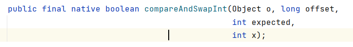

**CAS(无锁优化/乐观锁 自旋)**

- cas 方法，offset为要改的变量，expected为我当前期望的值，x为要改成的值

    如果期望的值与取出的变量值，说明别的线程改变这个值了，就重新调用cas，此时期望值就变成新值。
        
          if(offset == expected) {
           offset = x;
          }
        
          otherwise try again!
          cpu原语支持，保证原子性，不允许被打断
    T1_AtomicInteger.java

- ABA 问题

  变量A -> B -> A。Integer 基础类型不影响；如果是针对对象的引用，对象引用回来但是属性可能发生变化。
  
  可以通过版本控制，添加版本号 cas(version)、mark ball
    

底层用法unsafe类，单例设计模式通过反射getUnsafe获取cas方法

unsafe == c/c++的指针
底层针对操作系统发指令
